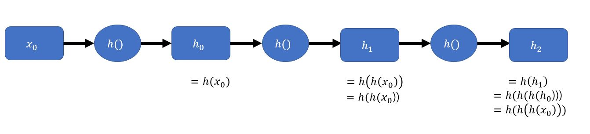
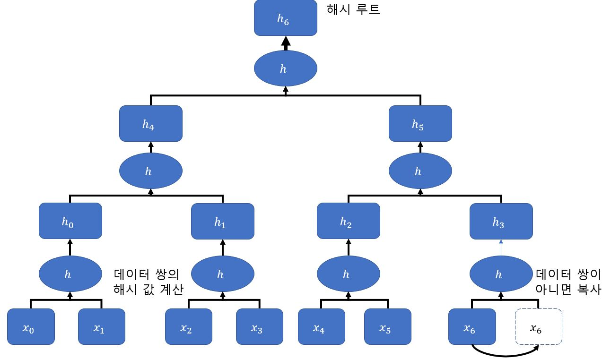
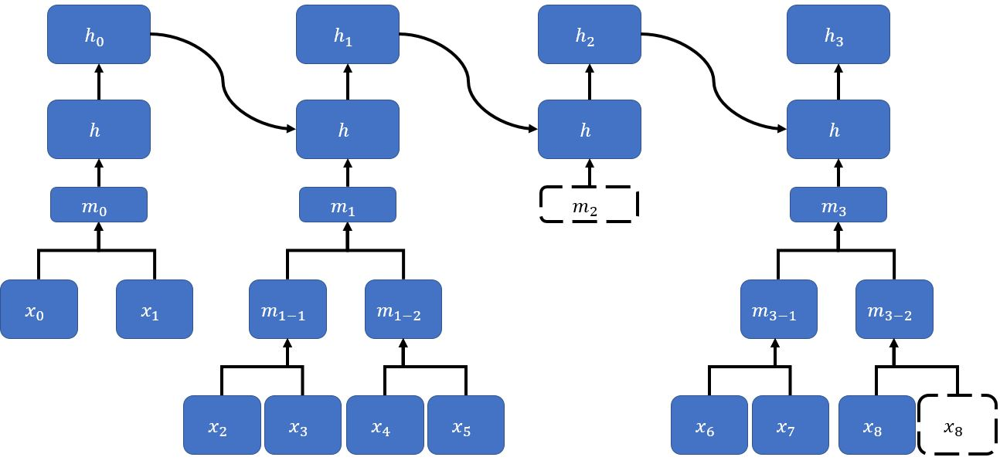

# CHAP. 2

## 블록체인의 타임스탬프 서버
**타임스탬프** 는 `2017-10-17 18:00:00` 과 같은 형식으로 날짜와 시간을 표시하는 문자열
이는 거래에서 거래 사실을 증명하는 중요한 역할을 한다.  
타임스탬프는 다음과 같은 `두 가지 특성` 이 있다.
- 모두가 같은 시간 흐름을 공유할 수 있다.
```
A와 B가 있을 때 B가 해외에 출장을 간 동안 돈을 받았더라도 표준 시간 기준으로 한국 시각이 언제인지 알 수 있다.  
(기준을 정할 수 있음)
```
- 시간은 되돌릴 수 없다.
```
시간 기록은 변하지 않는 것으로 사실을 증명할 수 있다.
```

그러나 **디지털 타임스탬프의 문제점** 이 있다.
- 사용 환경에 따라 실제 시간과 컴퓨터에 설정된 시간이 같다고 보장할 수 없다.
- 별도의 설정, 어플리케이션으로 사용자가 쉽게 변경이 가능하다.  

이와 같은 문제점이 있어, `타임스태프 서버` 로 발전한다.

### 중앙 집중형 시스템 타임스태프 vs 탈중앙화 시스템 타임스탬프
**관리만 잘 된다면** , `중앙 집중형 시스템`은 서비스의 데이터 무결성을 유지하기 쉽다.
그러나, 작업량이 많아지면 시스템이 느려지거나 에러가 발생하는 경우 **서비스 전체 상태에 영향을 미친다** . 이는 중앙 서버가 이상하게 되어 **타임스탬프로써의 신뢰성이 떨어진다.**  

  중앙 집중형 시스템과 반대로 `P2P 시스템`은 노드를 자원으로 활용하기 때문에 **관리자가 없는 시스템** 을 만들 수 있으나, 데이터의 무결성을 유지하기 어려워 타임스탬프 기록의 **신뢰성을 보장할 수 없다.**  

신뢰성을 보장하기 위해 모든 **노드는 특정 시간을 공유한 후, 앞뒤 순서를 암호학에 기초한 자료구조** 를 갖는 타임스탬프 구조를 고안함.

블록체인은 기존 P2P 시스템과 다른 타임스탬프 구조를 포함한 `탈중앙화 시스템` 을 구축한 것이다.

### 해시 체인 타임스탬프

블록체인은 암호화 해시 함수로 논리 데이터 저장 순서를 정의한다. 대표적인 예는 비트코인에서 이용하는 `SHA-256` 등이 있다. 해시 함수는 계산하기 쉽지만 반대로 입력값을 구하는 것은 어려운 `일방향 함수`이다. 따라서 해시값 `h(a)`는 데이터 `a`가 안전한 데이터라는 것을 보장한다.  데이터 하나에 재귀적으로 암호화 해시 함수를 적용한 기술을 `해시 체인` 이라고 한다. `일회성 비밀번호 인증` 시스템에 사용한다.

###### 해시 체인의 예


해시 체인은 데이터 X0 에 재귀적으로 암호화 해시 함수를 적용해 해시값 h0, h1, h2, ... 를 계산한다. **여기서 Origin 데이터는 X0 뿐이다.**
```
즉,  h2를 계산하려면 이전의 과정 h1, h0 .. 앞뒤 순서가 있어야 한다.
```

### 해시 트리
P2P 시스템에서 해시 체인을 사용하려면 두 가지 문제를 해결 해야 한다.
- 네트워크의 모든 노드가 항상 최신 타임스탬프를 확인할 수 있어야 한다.
- 어떤 노드에서 과거 데이터를 조작했음을 확인하거나 데이터 조작 자체를 막을 수 있어야 한다.

이를 위해 **해시 트리** 를 해시 체인으로 구성한다.

**해시트리는 어떤 데이터를 여러 조각으로 나눈 후 조각 2개를 묶어 해시값을 계산 그리고 계산한 해시값끼리 다시 2개로 묶는 방식으로 해시 값이 하나만 남을 때가지 반복 계산.** `마지막 남은 하나의 해시값을 해시 루트 혹은 최상위 해시라고 한다.`
###### 해시 트리
  

해시 트리 구조를 활용하여 해시 체인 타임스탬프를 블록 단위로 만든다.
###### 해시 체인으로 구성한 해시 트리
  

해시 체인은 새 데이터를 넣을 때마다 해시 체인의 데이터 개수가 늘지만, 해시트리는 블록 단위로 해시 체인의 데이터 개수가 는다.


### 계정 기반 잔액 저장 방식 vs 거래 기반 방식
- `계정 기반의 잔액 저장 방식`은 동시 발생 처리에 비효율 적으로 병렬 처리 기반의 분산 시스템에 부적절 하다.
- `거래 기반 방식`은 송금하는 두 거래가 동시에 발생하더라도 최종 잔액에 영향을 주지 않아, 분산 시스템에 효율적인 기능을 한다.
