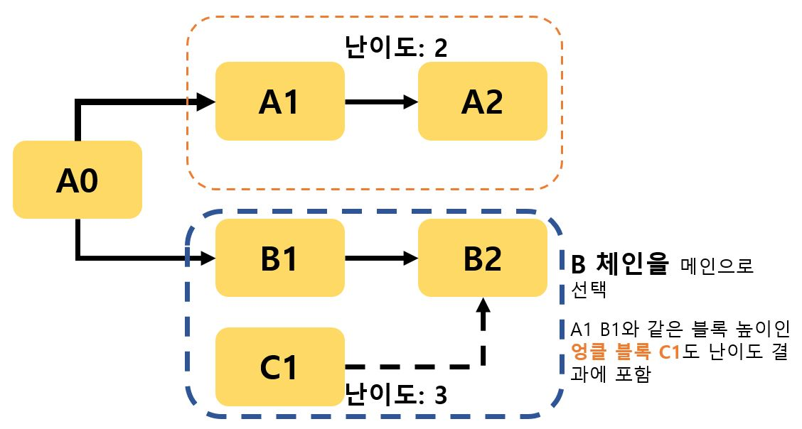

# CHAP. 3
## 스마트 계약과 이더리움 이해

### 스마트 계약
**스마트 계약** 이란  현실의 권리 증명이나 이동 등을 포함한 계약을 **자동으로 실행** 하는 구조를 스마트 계약(smart contract)이라고 한다.  

#### 블록체인 교환은 왜 스마트 계약인가?
블록체인의 암호화폐 교환은 송금과 보관을 **자동으로 실행** 하는 계약이기 때문이다.  


##### 비트코인의 기반 기술인 블록체인의 특징: **신뢰성, 탈중앙화**  
권리를  양도하거나 교환할 때도 누구에게 소유권이 이동했는지 명확하며 과거 이력을 확인할 수 있고, 조작 위험에서 벗어날 수 있다. 이는 기존의 비즈니스에 필요한 교환 과정, 시간 비용, 인건비, 중간 수수료 등이 없어 사용자에게 더 합리적인 비용이 든다.

#### 블록체인의 스마트 계약의 장점
1. 상대를 신뢰하지 않아도 거래에 문제가 발생하지 않는다.
현실에서는 개인 사이에 교환할 때 상대방을 신뢰한다는 전제를 두지만, 스마트 계약에서는 상대를 못 믿더라도 신뢰할 수 있는 거래를 자동으로 실행한다. `탈중앙화` 블록체인은 거래 정보를 저장해 누구든 참고할 수 있으므로 조작하기 어려워 **투명한 거래가 가능하다.**
2. 중개자가 필요 없어 비용을 절감한다.
상대방의 신뢰를 판단할 수 없는 거래라면 중개자나, 신용 기관이 있어야한다. 이는 중개를 하여 신뢰를 보장하는 비용인 `수수료`를 지급하여야 한다. 이런 수수료 지급 방식을 없애 **비용 절감** 이 가능하다.
```
실제 스마트 계약을 적용한 예로  재산 분할의 스마트 계약, 콘텐츠 수입 자동 지급, 보험금 자동 지급, 카 렌트, 자동 기부 시스템, 고용 계약 시스템, 전자 투표 ... 등이 있다.
```
--------
### 이더리움
이더리움은 이더리움 재단에서 관리하는 블록체인 플랫폼이다. 비트코인으로 블록체인 네트워크에서 탈중앙화 어플리케이션을 실행할 수 있는 스크립트 언어를 제공한다.  
이더리움에서 동작하는 어플리케이션은 특정 조건의 처리를 사전에 설정하며 해당 조건에 부합해야 실행할 수 있으므로 `스마트 계약`을 구현하는 데 적합하다.

#### 이더리움과 비트코인의 차이
**목표가 달라 구조가 다르다**
- 비트코인: `방해 없는 신속한 화폐 송금` 목적의 암호화폐 플랫폼
- 이더리움: `암호화폐 + 스마트 계약` 어플리케이션을 블록체인에서 실행하는 플랫폼

이더리움의 내부 화폐 단위는 `이더` 이다. 암호화폐나 애플리케이션을 실행하는 연료로 사용하는데, 이더리움에서는 이 비용을 `가스(gas)`라고 한다.

#### 가스
블록에 거래를 저장할 때 수수료를 지급하는데, 이때 수수료를 연료로 사용한다. 이더리움의 수수료는 노드의 프로그램 연산을 위한 연료로 가스라고 한다.  

거래를 실행할 때는 `가스 가격`과 `가스 제한`을 설정한다. 지급할 수 있는 `가스 상한`은 `가스 가격` X `가스 제한`이다.
가스를 상한액 까지 모두 사용하는 것은 아니며, 사용하지 않는 가스는 돌려받는다.
가스 상한은 `무한 루프를 막기위해` 있다. 프로세스 수에 따라 가스를 모두 소모했을 때 무한 루프를 중지할 수 있다.

#### 계정 구조
|계정 종류 | 설명 |
|---|---|
|외부 계정 | 이더리움 사용자를 위한 계정, 주소와 연결하여 잔액 정보를 갖는다 |
| 계약 계정 | 계약 증명이 있는 계정, 주소와 연결해 코드 정보 및 잔액 정보를 갖는다. 외부 계정에서 생성한다.|


이더리움 사용자의 잔액 정보를 블록에 넣어 블록 크기가 방대해 지는 일을 막기위해 계정 정보와 이더 잔액 정보는 `상태 트리`에 저장한다.  상태 트리는 `블록 외부에 저장, 각 블록에는 상태 트리의 루트 노드 값만 저장한다.`  
**이는 계정 정보를 별도의 자료구조로 분리해 빠른 검색이 가능하다는 장점이 있다.**  
 **그러나, 계정의 상태를 바꿀 때는 선입선출 방식의 작업을 해야하는 단점이 있다.**


| | 비트코인 | 이더리움 |
|---|---|---|
|잔액 확인 방식|사용하지 않은 금액을 담은 UTXO의 합으로 표현 |송금 내역을 블록에 거래로 저장 후, 계정 정보를 담은 상태 트리로 표현 |
|블록 생성 속도| 10분에 1회|약 15초(엉클 블록이 생성된 경우에도 보상을 주어 독식 문제 해결 ) |
|블록 선택 방식 |나카모토 합의법 |각 체인에 묶인 모든 블록들의(엉클 블록 포함) 생성 난이도를 더한 값이 제일 큰 체인 선택(고스트 프로토콜) |
| 작업 증명 알고리즘|SHA-256 해시 함수 |이더 해시 |

`엉클 블록` = `스테일 블록` : 두 명의 채굴자가 비슷한 시간에 블록을 채굴한 경우, 난이도가 낮은 체인. 수수료를 받을 수 없는 블록.  

`이더해시` : SHA-256은 전용 연산 하드웨어를 통해 `독식의 문제`가 있지만, 이더 해시는 전용 연산 하드웨어를 구축하는데 비용이 크기 때문에 `독식을 막는다.`

###### 블록 선택 방식(고스트 프로토콜)

