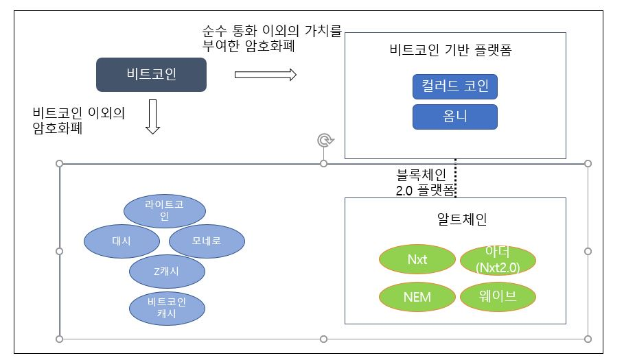
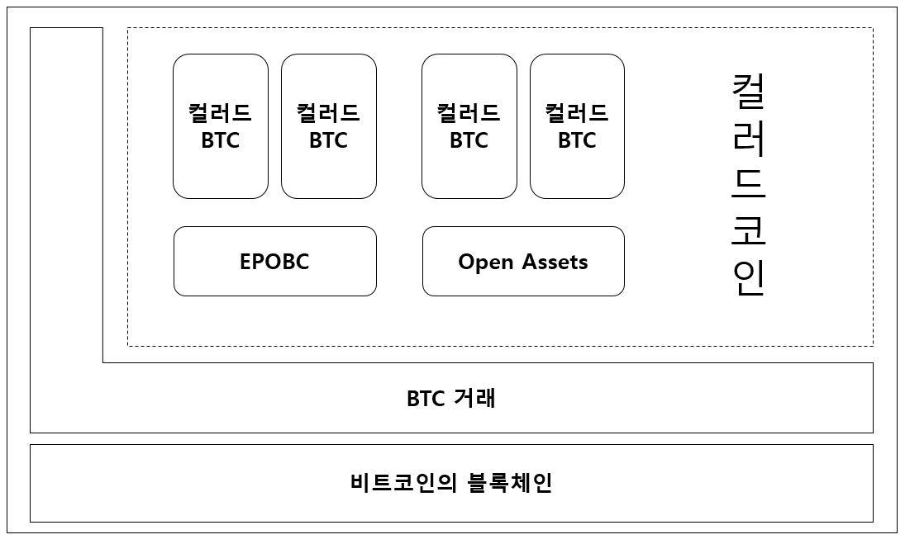
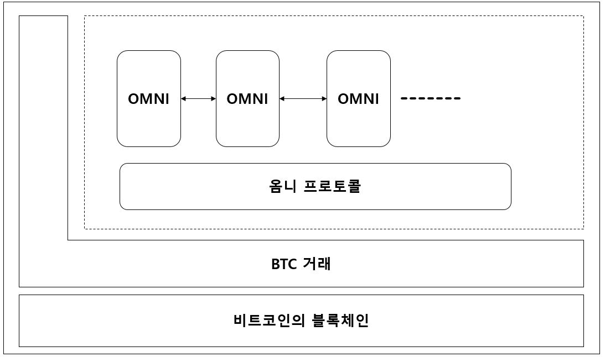

# CHAP. 4

## 블록체인 2.0과 스마트 계약 플랫폼

### 블록체인 2.0과 알트코인
```
* 블록체인 2.0 : 순수 통화 개념 이외의 별도 가치를 암호화폐에 부여
* 알트코인 : 비트코인 이후에 등장한 암호화폐
```  


#### 컬러드 코인
컬러드 코인은 BTC를 특정 자산과 연결해 별도의 가치를 부여하겠다는 플랫폼 제안이다. 다른`색` , 이는 기존 프로토콜을 변경해 활용하겠다는 의미이다.  
컬러드 코인을 바탕으로 구현한 `EPOBC`와 `Open Assets`가 있다. 이는 10분에 1회의 블록 간격 제약이 있다.

`컬러드 코인`에서 발행한 자체 암호화폐는 다른 블록체인 플랫폼과 **서로 호환하지 않지만**, `옴니`에서 발행한 화폐는 분산 거래 시스템을 이용해 다른 블록체인 플랫폼의 암호화폐와 **교환이 가능하다.**
###### 컬러드 코인의 구조

#### 옴니
옴니 또한 비트코인 블록체인 안에서 자체 암호화폐를 만들어 특정 자산과 연결하여 거래하는 플랫폼이다.
###### 옴니의 구조


#### 알트코인
##### 라이트 코인

비트코인 블록체인 기반으로 새로 만든 플랫폼 LTC. 블록 간격을 2.5분에 1번으로 설정하여 더 간편하게 채굴하는 것을 목표로 한다.  
비트 코인보다 4배 빠른 생성속도, 약 4년에 한 번씩 채굴 보상이 줄어드는 점은 같다.
###### 익명 암호화폐
블록체인에 저장한 블록 잔액, 개인 정보 등 특징을 보호하가 위해 익명성을 강화한 암호화폐가 등장함. `DASH, XMR, ZEC`
* 대시는 익명성을 높이려고 직접 거래하는 것이 아니라, `거래 풀`을 이용하는 방법을 이용한다.
* 모네로는 `링 서명`을 이용한 것으로, 여러 사람이 그룹을 형성하여 거래에 서명한다. 제 3자는 그룹의 누가 서명했는지 등의 정보를 알기 어렵다.(단, 이중 지급의 위험성 있음)
* Z캐시는 `제로 지식 증명`을 사용한다. 제 3자가 증명하는 암호화 기술로 거래 정보를  거래 당사자 두 사람 이외에는 아무도 알 수 없게 숨긴다.

##### 비트코인 캐시
기존의 비트코인 블록 용량의 제한을 없애려고 `하드 포크`하여 만든 알트코인이다.  
비트코인의 용량은 `1MB`, 비트코인 캐시는 `8MB`이다.  

`하드 포크`: 새롭게 생긴 코인이 기존에 사용되던 코인과 공동, 호환 되지 않는, 새로운 블록체인 시스템으로 나뉘는 것이다.  
  
하드포크가 일어나기전 비트코인을 가지고 있었다면 이는 그대로 가지면서, 비트코인 캐시를 새롭게 받게 된다.


#### 알트체인
알트코인을 발행할 수 있는 `알트체인`
##### Nxt
독자적인 암호화폐 발행, 메시지 전송, 투표, 오픈마켓 등의 기능 제공.
**작업 증명 알고리즘 대신 지분 증명 알고리즘을 적용함**  
많은 연산을 할 필요가 없다.  
채굴 경쟁 문제 때문에 블록 생성 후 약 12시간(1440 블록)이상 다른 블록을 생성할 때까지 체인에 유지되어야 채굴에 참여 가능한 제한이 있다.

`지분 증명 알고리즘` : 현재 소유한 암호화폐의 잔액에 따라 채굴로 블록 생성할 확률을 동적으로 설정하는 프로토콜


##### 아더
아더는 `Nxt의 확장성 문제를 보완`한 것이다. Nxt는 모든 거래를 하나의 블록체인으로 구성하는 플랫폼으로, 사용자가 늘면 거래 확정을 분산 처리하기 힘들다.  
메신 체인에 연결할 수 있는 `독립적인 자식 체인을 자유롭게 생성`할 수 있다. 메인 체인은 자식 체인 관리, 보호를 한다.


----
### 스마트 계약 플랫폼
